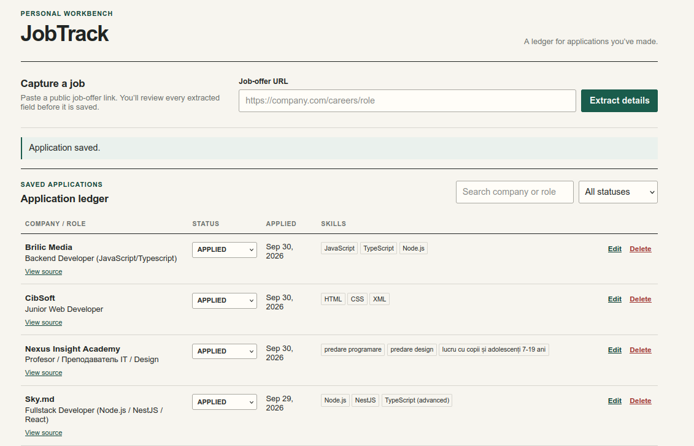

# JobTrack

A local, single-user workbench for turning public job-offer URLs into reviewed application records.

## Main page

The main workbench showing the URL capture flow and example saved applications.



## Run it

```bash
cp .env.example .env
docker compose up --build
```

Open [http://localhost:3000](http://localhost:3000). The API health check is at `http://localhost:3001/api/health`.

The Compose API runs the TypeORM migration and idempotently seeds one development user before it starts. Set `SEED_USER_EMAIL` and `SEED_USER_PASSWORD` in `.env`; the seed password is bcrypt-hashed. `DEV_USER_ID` is optional and is useful only when explicitly pointing the current-user abstraction at an existing seeded user.

`AI_PROVIDER=mock` is the safe, no-key default and provides a conservative metadata/keyword preview for local setup. To use OpenAI extraction, set `AI_PROVIDER=openai`, `OPENAI_API_KEY`, and optionally `OPENAI_MODEL`.

To use OpenRouter, set `AI_PROVIDER=openrouter`, `OPENROUTER_API_KEY`, and optionally `OPENROUTER_MODEL`. The default is `openai/gpt-4.1-mini`: a strong fit for a small, factual JSON extraction task because it supports structured outputs and has a low reported structured-output error rate. `OPENROUTER_HTTP_REFERER` is optional; use it only for OpenRouter app attribution. The API requests strict JSON Schema output and still validates every response before it reaches the frontend.

In every provider mode, the result is an editable preview and is never saved automatically.

## Extraction diagnostics

When an AI response cannot be parsed or fails validation, JobTrack persists a bounded diagnostic record containing the provider, source URL, validation error, and raw AI response. It intentionally does not persist the full scraped page text. After restarting the API so migration `1710000000002` runs, inspect recent failures with:

```bash
curl http://localhost:3001/api/applications/extraction-diagnostics
```

You can also review the record IDs and errors in the API container logs:

```bash
docker compose logs api --tail=100
```

## Commands

```bash
npm install
npm run lint
npm run typecheck
npm run test
npm run build
npm run db:migrate
npm run db:seed
```

For local non-Docker development, point `DATABASE_URL` at PostgreSQL and run `npm run dev`.

## Notes

- The URL ingestion path permits HTTP(S) only, rejects loopback/private/link-local and metadata hosts, resolves DNS before each request/redirect, limits redirects, timeout, HTML response type, response size, and AI input length.
- Application records are always resolved through `CurrentUserService`; arbitrary IDs cannot cross the seeded user boundary.
- The API has no authentication by design. Replacing the development current-user service with an authenticated identity provider is the cleanest next extension point.
